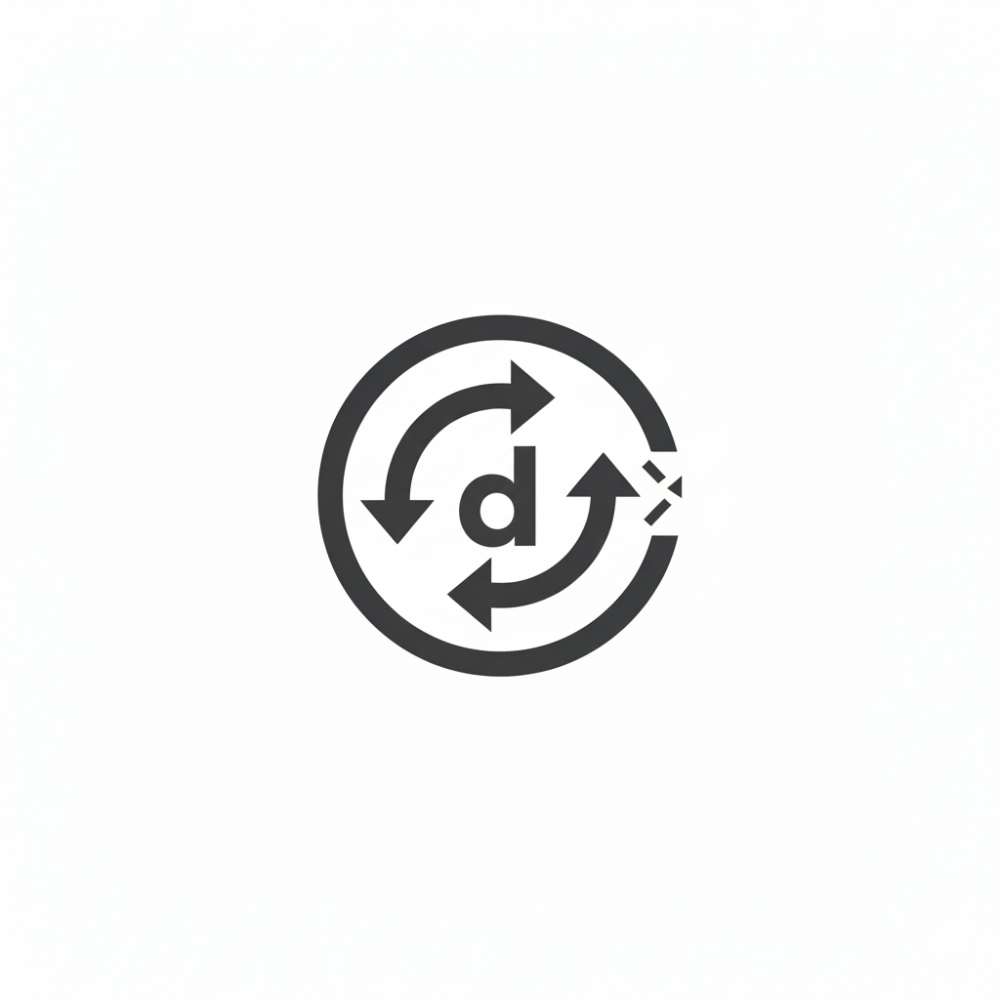

# DynamoDB CRUD



[](https://crates.io/crates/dynamodb-crud)
[](https://docs.rs/dynamodb-crud)
[](https://opensource.org/licenses/MIT)

**Type-safe DynamoDB operations that feel natural in Rust.**

No more wrestling with attribute values or expression strings: just clean, composable code that catches errors at compile time.

## Why?

Working with DynamoDB in Rust shouldn't mean manually building expression strings or converting between types. This crate gives you:

- ✅ **Type safety** - Catch errors before they hit production
- ✅ **Ergonomic API** - Intuitive operations that read like your code
- ✅ **Full feature support** - Get, Put, Update, Delete, Query, Scan, and Batch operations
- ✅ **Zero boilerplate** - Let the compiler handle the details

## Quick Start

```toml
[dependencies]
dynamodb-crud = "0.1.0"
```

### Basic Operations

```rust
use aws_config::load_from_env;
use aws_sdk_dynamodb::Client;
use dynamodb_crud::{common, read, write};
use serde_json::json;

let config = load_from_env().await;
let client = Client::new(&config);

// Put an item
let put_item = write::put_item::PutItem {
    item: json!({"id": "1", "name": "John", "age": 30}),
    write_args: write::common::WriteArgs {
        table_name: "users".to_string(),
        ..Default::default()
    },
};
put_item.send(&client).await?;

// Get an item
let get_item = read::get_item::GetItem {
    keys: common::key::Keys {
        partition_key: common::key::Key {
            name: "id".to_string(),
            value: "1".to_string(),
        },
        ..Default::default()
    },
    single_read_args: read::common::SingleReadArgs {
        table_name: "users".to_string(),
        ..Default::default()
    },
    ..Default::default()
};
get_item.send(&client).await?;
```

### The Real Advantage: Complex Updates Without Expression Strings

Instead of manually building update expressions like `"SET #name = :name, #age = #age + :inc ADD #tags :tags REMOVE #oldAttr"` and managing placeholders, just use structured types:

```rust
use dynamodb_crud::{common, write};
use serde_json::Value;

// Update multiple attributes with different operations
let update_item = write::update_item::UpdateItem {
    keys: common::key::Keys {
        partition_key: common::key::Key {
            name: "id".to_string(),
            value: Value::String("1".to_string()),
        },
        ..Default::default()
    },
    update_expression: write::update_item::UpdateExpressionMap::Combined(vec![
        // SET: Update name and increment age
        write::update_item::UpdateExpressionMap::Set(
            write::update_item::SetInputsMap::Leaves(vec![
                ("name".to_string(), write::update_item::SetInput::Assign(Value::String("Jane".to_string()))),
                ("age".to_string(), write::update_item::SetInput::Increment(Value::Number(1.into()))),
            ]),
        ),
        // ADD: Add tags to a set
        write::update_item::UpdateExpressionMap::Add(
            write::update_item::AddOrDeleteInputsMap::Leaves(vec![
                ("tags".to_string(), Value::Array(vec![
                    Value::String("new".to_string()),
                    Value::String("feature".to_string()),
                ])),
            ]),
        ),
        // REMOVE: Delete an old attribute
        write::update_item::UpdateExpressionMap::Remove(
            common::selection::SelectionMap::Leaves(vec!["oldAttr".to_string()]),
        ),
    ]),
    write_args: write::common::WriteArgs {
        table_name: "users".to_string(),
        ..Default::default()
    },
};
update_item.send(&client).await?;
```

The crate automatically:

- ✅ Builds the expression string: `"SET #name = :set0, #age = #age + :set1 ADD #tags :add_or_delete2 REMOVE #oldAttr"`
- ✅ Manages expression attribute names: `{"#name": "name", "#age": "age", ...}`
- ✅ Manages expression attribute values: `{":set0": "Jane", ":set1": 1, ...}`
- ✅ Handles nested paths: `user.profile.email` becomes `#user.#profile.#email`

### Query with Filters and Conditions

Query with complex conditions without writing expression strings:

```rust
use dynamodb_crud::{common, read};
use serde_json::Value;

let query = read::query::Query {
    partition_key: common::key::Key {
        name: "userId".to_string(),
        value: Value::String("user123".to_string()),
    },
    sort_key_condition: Some(common::condition::KeyCondition {
        name: "timestamp".to_string(),
        condition: common::condition::Condition::GreaterThan(Value::Number(1000.into())),
    }),
    multiple_read_args: read::common::MultipleReadArgs {
        table_name: "events".to_string(),
        // Filter expression: status = "active" AND priority > 5
        condition: Some(common::condition::ConditionMap::Leaves(
            common::condition::LogicalOperator::And,
            vec![
                common::condition::KeyCondition {
                    name: "status".to_string(),
                    condition: common::condition::Condition::Equals(Value::String("active".to_string())),
                },
                common::condition::KeyCondition {
                    name: "priority".to_string(),
                    condition: common::condition::Condition::GreaterThan(Value::Number(5.into())),
                },
            ],
        )),
        // Only return specific attributes
        selection: Some(common::selection::SelectionMap::Leaves(vec![
            "eventId".to_string(),
            "message".to_string(),
        ])),
        ..Default::default()
    },
    ..Default::default()
};
query.send(&client).await?;
```

### Conditional Writes

Add conditions to prevent overwrites or ensure data integrity:

```rust
use dynamodb_crud::{common, write};
use serde_json::Value;

// Only update if the item exists and age is >= 65
let update_item = write::update_item::UpdateItem {
    keys: common::key::Keys {
        partition_key: common::key::Key {
            name: "id".to_string(),
            value: Value::String("1".to_string()),
        },
        ..Default::default()
    },
    update_expression: write::update_item::UpdateExpressionMap::Set(
        write::update_item::SetInputsMap::Leaves(vec![
            ("status".to_string(), write::update_item::SetInput::Assign(Value::String("retired".to_string()))),
        ]),
    ),
    write_args: write::common::WriteArgs {
        table_name: "users".to_string(),
        condition: Some(common::condition::ConditionMap::Leaves(
            common::condition::LogicalOperator::And,
            vec![
                common::condition::KeyCondition {
                    name: "age".to_string(),
                    condition: common::condition::Condition::GreaterThanOrEqual(Value::Number(65.into())),
                },
                common::condition::KeyCondition {
                    name: "status".to_string(),
                    condition: common::condition::Condition::NotEqual(Value::String("retired".to_string())),
                },
            ],
        )),
        ..Default::default()
    },
};
update_item.send(&client).await?;
```

## Documentation

- 📚 [Full Documentation](https://docs.rs/dynamodb-crud)
- 📦 [Crates.io](https://crates.io/crates/dynamodb-crud)
